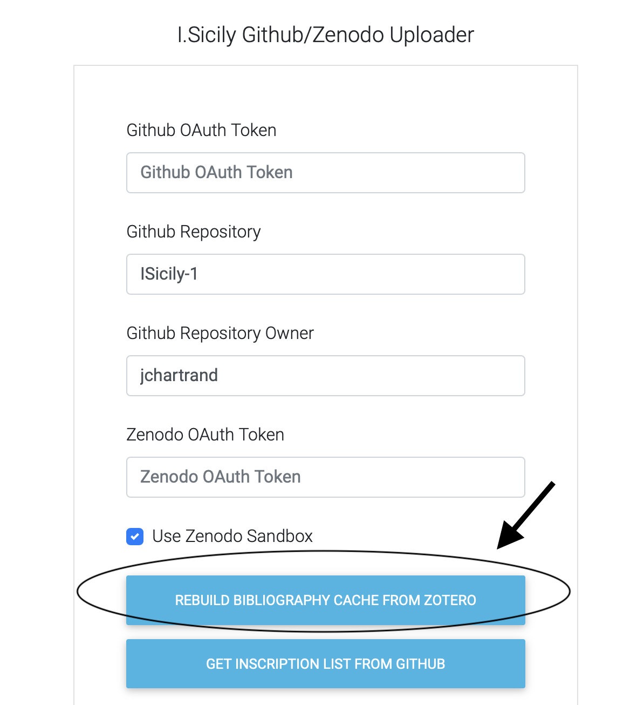
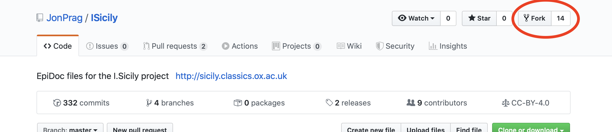
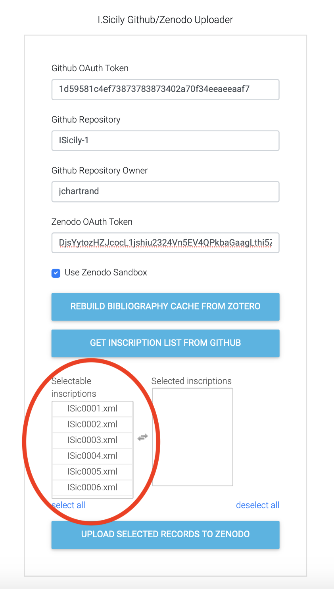
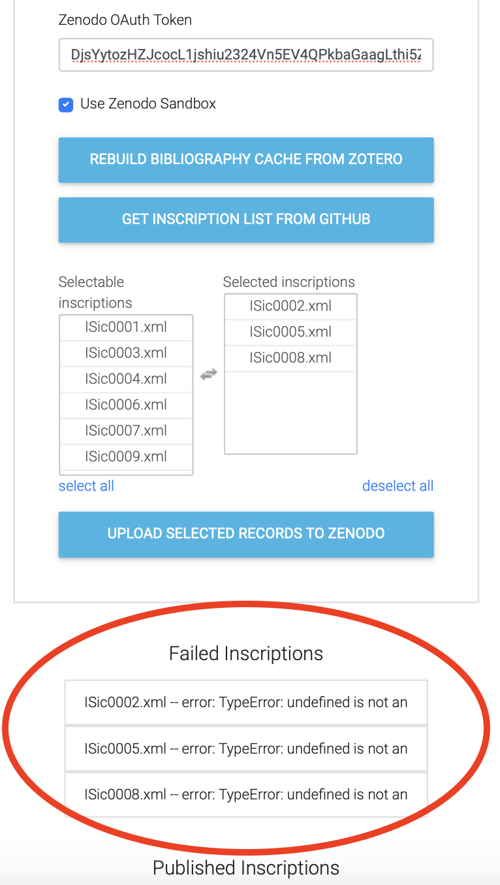
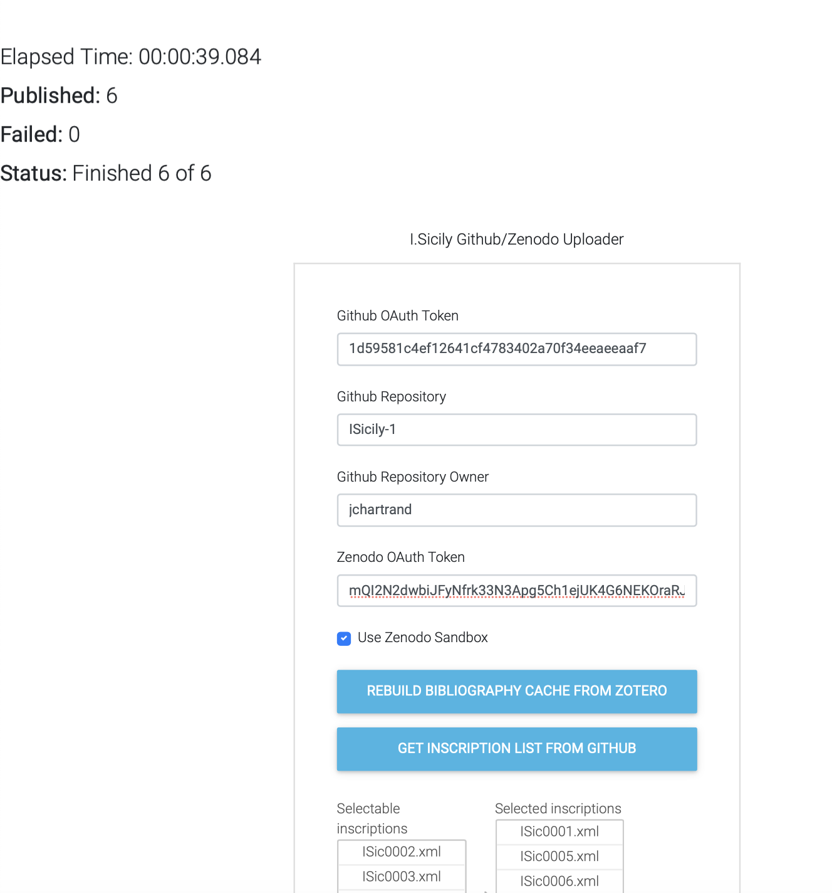

## I.Sicily Zenodo uploader

Reads I.Sicily TEI XML epidoc files from the I.Sicily Github repository (https://github.com/JonPrag/ISicily) or from a 'forked' copy of that repository, and for each file builds a PDF that describes 
the inscription, then uploads the PDF and the associated TEI XML file to Zotero, in the process creating a new DOI for the file.  
The new DOI is also recorded in the PDF and the TEI XML file.  The TEI XML file is saved back to the Github repository. 

[Preparation](#preparation)
* [Images](#images)
* [Cache Zotero for Bibliographic References](#cache-zotero-for-bibliographic-references)
* [Fork main repository](#fork-main-repository)
* [Create a copy of the I.Sicily Repository](#create-a-copy-of-the-i.sicily-repository)

[Use](#use)

### Preparation

There are a few things you have to get ready before you actually invoke the upload.

#### Images

The PDF includes any images referenced in the facsimile/surface/graphic section with attribute n='print', e.g.

```xml
 <facsimile>
        <surface type="front">
            <graphic n="screen" url="ISic0007_tiled.tif" height="2034px" width="4608px">
                <desc>Photo by Metcalfe</desc>
            </graphic>
            <graphic n="print" url="ISic0007.jpg" height="2034px" width="4608px">
                <desc>Photo by Metcalfe</desc>
            </graphic>
        </surface>
    </facsimile>
```

The images themselves must be in the images directory and must have names that match those in the TEI file, but with '_small' appended to the file name.  So, taking the example above, where
the file name in the 'url' attribute of the 'graphic' element (with attribute n="printy") is 'ISic0007.jpg', there must then be an image in the images directory called
'ISic0007_small.jpg'

 
#### Cache Zotero for Bibliographic References

The PDF includes any listed bibliographic references for the inscription.  The references are taken from any TEI/text/body/div[@type=bibliography]/listBibl/bibl elements, like this one:
```XML
<bibl type="AE">
    <citedRange>1895.0023</citedRange>
    <ptr target="http://zotero.org/groups/382445/items/R46KDTZX"/>
</bibl>and uploads both the XML file and PDF to Zenodo.  
```
The zotero reference (e.g., `http://zotero.org/groups/382445/items/R46KDTZX`) is expanded (to include authors, title, etc.) on-the-fly during construction of the PDF, using a copy of the Zotero bibliography that has been downloaded and stored locally using the 'Rebuild Bibliography Cached From Zotero' button on the uploading form:



This cache must be available or the uploading will fail.  The cached file will appear in the root directory as cachedBibl.json and should be between 1 and 2 Megabytes.  Refresh the cache anytime a change has been made to the Zotero bibliography.

#### Create a copy of the I.Sicily Repository

The upload can be run directly on the I.Sicily github respository itself, which will directly modify 
every uploaded XML file(by writing a new DOI into the epidoc), but 
a safer approach is to fork the I.Sicily Github repository
and run the upload on the forked copy.  

Forking is described here (https://help.github.com/en/github/getting-started-with-github/fork-a-repo) but is as simple as clicking the fork button in the I.Sicily repository:



After the upload is finished create a pull request (https://help.github.com/en/github/collaborating-with-issues-and-pull-requests/about-pull-requests) from the forked repository back to the original
I.Sicily repository.  

Running the upload on the forked copy allows one to check for problems before actually modifying the original repository.  It also makes it easier to
see in the Github history which commits were part of the upload.

#### Use

Open the upload form (which is in the Github repository that you are actually looking at now):

https://jchartrand.github.io/zenodo-git-up/public/index.html

Complete the form with:

- Github OAuth Token

A Github token which you can get as described here:  https://help.github.com/en/github/authenticating-to-github/creating-a-personal-access-token-for-the-command-line
  
The token has to be a token given to the owner of the repository from which we are reading the I.Sicily files (so either the I.Sicily repo itself, or a forked copy).  

This token allows the uploader to write back the XML files to the repository after having updated the DOI and the change log in each file.
  
- Github Repository

The name of the Github repository holding the I.Sicily files.  Preferably a forked copy of the I.Sicily repository as explained above in [Create a copy of the I.Sicily Repository](#create-a-copy-of-the-i.sicily-repository)
.

- Github Repository Owner

The name of the Github user (account) that owns the repository holding the I.Sicily files, e.g., JonPrag is the owner of the I.Sicily repository.  If you fork a copy of the I.Sicily repository then the owner will be the account to which you forked the copy (which could also be JonPrag)

- A Zenodo token

which you can get here:  https://zenodo.org/account/settings/applications/tokens/new/

NOTE:  if you using the Zenodo sandbox, you need to get a token for the sandbox, which you do as you would from zenodo.org, but instead from sandbox.zenodo.org

- Use Zenodo Sandbox

Check this box if you'd like to try run the upload on Zenodo's sandbox.  The Zenodo sandbox is meant for experimentation and testing.  Anything written to the sandbox, and any DOIs created in the sandbox, are not permanent and are regularly deleted.  So, you'd use this if you wanted to, for example, try a dry run.
NOTE:  if you using the Zenodo sandbox, you need to get a token for the sandbox, which you do as you would from zenodo.org, but instead from sandbox.zenodo.org

So, okay, those are the form fields.  There are two buttons at the bottom of the form.  The first, Cache Zotero for Bibliographic References, creates a local cache of the Zotero bibliography as explained above in [Cache Zotero for Bibliographic References](#cache-zotero-for-bibliographic-references)

The second button 'Get Inscription List from Github' will get a list of all the inscriptions in the repository you specified.

Click it!

You should eventually (in a minute or two) see something like:



Now you can select which specific inscriptions you'd like to publish to Zotero by clicking each is the 'selectable inscriptions'
list or by clicking 'select all'.

Then click 'Upload Selected Records To Zenodo' to start the upload.  It could take quite a while if you've selected a lot of inscriptions.

Any inscriptions that don't upload for whatever reason or have problems will appear in the 'Failed Inscriptions list':



And all that succeeded will appear in the 'Published Inscriptions List'

Note that you can check overall progress by scrolling to the top of the page where a summary is shown:


